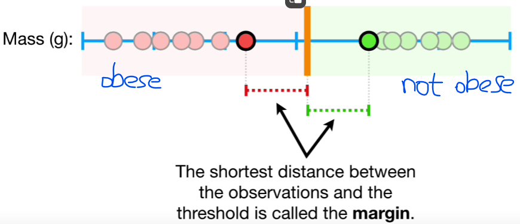

# Support Vector Machine

We find the observations on the edge of each cluster and use the midpoint between them as threshold. If a new point falling on the left regards as obese. Conversely, it can be viewed as not obese.
The shortest distance between the observations and the threshold is called the Margin.
